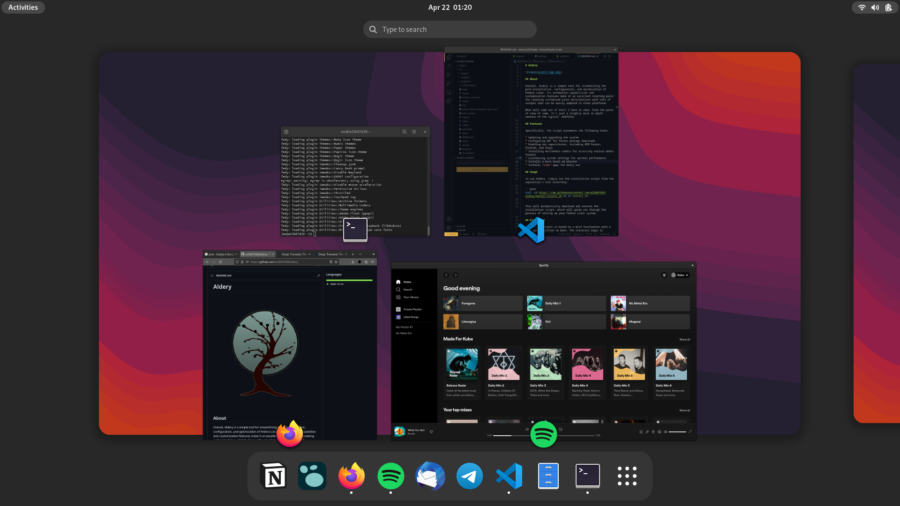

---

VOPI is a script that autoinstalls and autoconfigures a fully-functioning environment for Void Linux.

## Usage
You can just run the install script from the root of the repository's folder.

```
curl -LO https://raw.githubusercontent.com/balintkiraly/vopi/master/install.sh
sh install.sh
```
